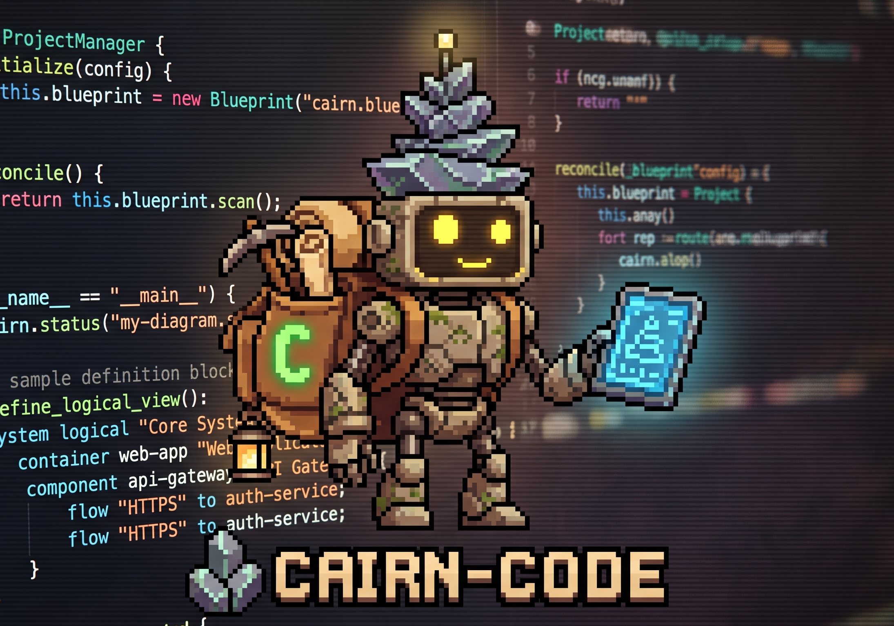

<p align="center">
  
</p>

# Cairn Code

A terminal-based coding agent, built by Cairn.

Cairn Code runs on macOS and Linux. It lives in your terminal and works across multiple LLM providers, reading files, writing and editing code, running shell commands, and searching your codebase to carry out a task from a natural-language instruction.

## Features

- **Multi-provider LLM support**: Anthropic, OpenAI, OpenRouter, xAI/Grok, and local models via Ollama, switchable per session
- **Agentic tool loop**: reads files, writes and edits code, runs shell commands, and searches the codebase autonomously until the task is done
- **Skills + MCP**: on-demand skill packs and Model Context Protocol server support
- **Real-time streaming**: token-by-token output with live tool activity and thinking display
- **Terminal UI**: a fast, keyboard-driven interface with provider/model pickers and syntax-highlighted code
- **Cost tracking**: per-session and per-call token usage
- **Permission system**: configurable auto-approve, ask, and deny rules per tool
- **Self-updating**: built-in `cairn update` command to stay on the latest version
- **Non-interactive mode**: scriptable, pipeline-friendly execution

## Get started

Install the latest release binary:

```sh
curl -fsSL https://raw.githubusercontent.com/cairn/cairn/main/install.sh | sh
```

Or download binaries directly from the [Releases](../../releases) page:
- **macOS (Apple Silicon)**: `cairn-code-macos-aarch64`
- **macOS (Intel)**: `cairn-code-macos-x86_64`
- **Linux (x86_64)**: `cairn-code-linux-x86_64`
- **Linux (ARM64)**: `cairn-code-linux-aarch64`

## Updating

Run the built-in update command:

```sh
cairn update
```

## Feedback & bug reports

This repository does not host Cairn Code's source. Use [GitHub Issues](../../issues) to report a bug, request a feature, or share feedback.

## License

Proprietary. All rights reserved. See [LICENSE](LICENSE).

This is not open source. Cairn Code's source is not published in this repository, and nothing here licenses that source for use, modification, or distribution.

You may download the published release binaries and run them on your own machine. That is written permission to copy those binaries onto your computer and to use them. It does not grant any other right.

© euxaristia 2026. All rights reserved.
